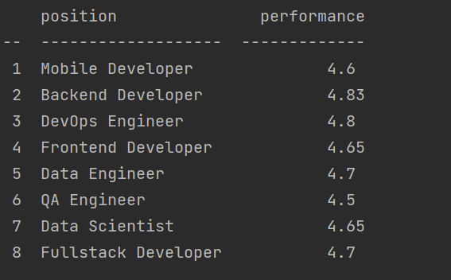
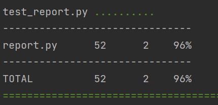

## Скрипт для формирования отчета performance
Данный скрипт формирует отчет с информацией о средней эффективности по позиции.
Код находиться в файле report.py. Для корректной работы запускать скрипт нужно с параметрами `--files` и `--report`.
- В параметре `--files` нужно перечислить файлы, по которым будет формироваться отчет. 
Файлов может быть несколько (по условиям задачи ожидается, что они будут в формате csv, а их содержимое всегда валидно).  
- В параметре `--report` передается название отчета. В данном случае реализован только один - 'performance'.

### Запуск скрипта
1. Склонировать репозиторий.
```commandline
git clone https://github.com/VarvaraKorneeva/performance_report.git
```
2. Перейти в папку performance_report, создать и активировать виртуальное окружение.
```commandline
cd performance_report
```
```commandline
python -m venv venv
```
```commandline
.\venv\Scripts\activate
```
3. Установить зависимости из requirements.txt.
```commandline
pip install -r requirements.txt
```
4. Запустить скрипт с нужными аргументами. Например:
```commandline
python report.py --files data/employees1.csv data/employees2.csv --report performance
```
Результат выполнения скрипта с данными аргументами будет следующим:


### Тестирование
Тесты написаны с помощью pytest и находятся в файле test_report.py.
Запустить тесты можно следующей командой:
```commandline
pytest test_report.py
```
Для просмотра процент покрытия:
```commandline
pytest test_report.py --cov=report
```


### Возможность добавления новых отчетов
Формирование отчета происходит в отдельной функции. 
Для добавления нового отчета:
1. Реализовать функцию, которая будет вычислять требуемые значения.
2. Добавить условие в функцию `get_report`, где в зависимости от названия отчета, переданного в аргументе `--report`,
вызывается соответствующая функция.
3. Для вывода отчета в консоль в новом условии добавленном в пункте 2 задать переменную `headers` с заголовками для колонок отчета.
